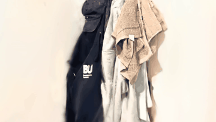

# Video to 3D Gaussian Splatting

End-to-end system that reconstructs a 3D scene from a short phone video of an indoor space.

One command takes a video in, produces a viewable 3D Gaussian Splat out:

```bash
python run.py --video room.mp4 --output results/
```

## Results



> *Fly-through rendered from trained 3D Gaussians.*

The output `point_cloud.ply` can be opened in [SuperSplat](https://playcanvas.com/supersplat/editor), [antimatter15 viewer](https://antimatter15.com/splat/), or any 3DGS-compatible tool. A fly-through video (`flythrough.mp4`) is also generated automatically.

## How It Works

```
Video ──► Frame Extraction ──► COLMAP SfM ──► Gaussian Splatting ──► PLY + Video
           (adaptive blur      (pycolmap,       (gsplat MCMC,         (standard
            + stride filter)    sequential       30k iterations)        3DGS format)
                                matching)
```

**Stage 1 — Frame Extraction** (`src/frame_extractor.py`)
Pre-scans the video for sharpness and motion statistics, then extracts the sharpest frames at adaptive intervals. Frame count scales with video duration (~80 frames/min, minimum 300) so both 1-minute clips and 10-minute walkthroughs work without manual tuning.

**Stage 2 — Camera Pose Estimation** (`src/pose_estimator.py`)
Runs COLMAP Structure-from-Motion via pycolmap: SIFT feature extraction, sequential matching (overlap=20, exploiting video temporal ordering), and incremental reconstruction. Outputs COLMAP binary format directly — no coordinate system conversions needed.

**Stage 3 — Gaussian Splatting Training** (`src/gaussian_trainer.py`)
Trains 3D Gaussians using [gsplat](https://github.com/nerfstudio-project/gsplat)'s rasteriser with the MCMC density control strategy ([Kheradmand et al., NeurIPS 2024](https://arxiv.org/abs/2404.09591)). MCMC replaces manual densification tuning with a stochastic process that automatically converges to the right number of Gaussians — no `densify-grad-thresh` or `stop-split-at` to fiddle with.

**Stage 4 — Export** (`src/exporter.py`)
Converts the trained checkpoint to a standard 3DGS PLY file (with full SH coefficients, scales, rotations, opacities) and renders a fly-through video from all training camera poses.

## Setup

**Requirements:** Linux with NVIDIA GPU, Python 3.10–3.12, CUDA 12.x.

```bash
git clone https://github.com/YunaGuo0909/video-to-3dgs.git
cd video-to-3dgs
bash setup.sh
```

The setup script auto-detects CUDA version, creates a venv with `uv`, and installs PyTorch + gsplat + all dependencies.

**If your home directory has limited disk quota** (common on shared machines):

```bash
bash setup.sh --venv /path/to/large/disk/.venv --cache /path/to/large/disk/.uv-cache
```

**Verify:**
```bash
source .venv/bin/activate
python -c "import gsplat; print(gsplat.__version__)"
```

## Usage

**Basic — one command, default settings:**
```bash
python run.py --video room.mp4 --output results/
```

**With image downscaling** (for 4K video or limited GPU memory):
```bash
python run.py --video room_4k.mp4 --output results/ --downscale 2
```

**Custom training length:**
```bash
python run.py --video room.mp4 --output results/ --max-steps 50000
```

### Output Structure

```
results/
├── images/              # Extracted frames
├── sparse/0/            # COLMAP reconstruction (binary)
├── results/ckpts/       # Training checkpoints
├── point_cloud.ply      # Final 3DGS PLY (viewable in SuperSplat)
└── flythrough.mp4       # Rendered fly-through video
```

### Tips for Best Results

- **Record slowly** — walk around the scene at a steady pace, avoid fast pans.
- **Cover all angles** — walk a loop around the room, don't just go one direction.
- **1080p is sufficient** — 4K works but uses more GPU memory (use `--downscale 2`).
- **60–90 seconds** is the sweet spot for a small room.

## Design Choices

### Why 3D Gaussian Splatting?

3DGS produces explicit geometry (a set of positioned, coloured Gaussians) that can be exported, viewed, and edited directly — unlike NeRF which stores geometry implicitly in network weights. Training is also 5–10x faster: ~25 minutes on an RTX 4070 vs hours for comparable NeRF quality.

### Why MCMC over classical densification?

Standard 3DGS uses a hand-tuned heuristic (split Gaussians where screen-space gradient exceeds a threshold, stop at iteration N). This requires per-scene parameter tuning — too aggressive causes needle artifacts, too conservative causes blur.

MCMC ([Kheradmand et al., NeurIPS 2024](https://arxiv.org/abs/2404.09591)) replaces this with a principled stochastic process: Gaussians are proposed, relocated, and pruned to minimise the rendering loss. The only hyperparameter is `cap_max` (maximum Gaussian count), which is hardware-dependent rather than scene-dependent.

### Why pycolmap instead of COLMAP binary?

pycolmap provides the same COLMAP algorithms as pure Python calls — no system-level installation needed. Sequential matching (vs exhaustive) exploits video frame ordering for O(n) matching time instead of O(n^2).

### Why adaptive frame extraction?

A fixed frame rate fails on diverse videos: a tripod-mounted capture wastes frames on near-duplicates, while a fast-moving handheld needs more frames to maintain overlap. The extractor pre-scans the video and adapts both the blur threshold and temporal gap to the content.

## References

- Kerbl et al., "3D Gaussian Splatting for Real-Time Radiance Field Rendering", SIGGRAPH 2023.
- Kheradmand et al., "3D Gaussian Splatting as Markov Chain Monte Carlo", NeurIPS 2024.
- gsplat: https://github.com/nerfstudio-project/gsplat
- COLMAP: Schonberger and Frahm, "Structure-from-Motion Revisited", CVPR 2016.

## License

MIT
